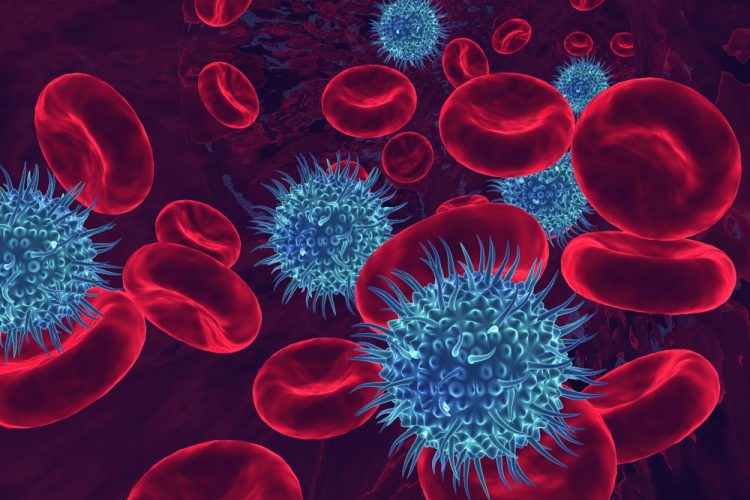

<p align="center"></p>

This repository contains the MAIDS description for project U21-01. It was built by cloning the [MAIDS-Template](https://github.com/PERSIMUNE/MAIDS-Template). You will find more details about this dataset below with links to visit the website and download the PDF.

>MAIDS is currently being prototyped for the [Copenhagen Ultrathon on Precision Medicine](https://ultrathon.online) where you will find more information about the event. You may also be interested in viewing other examples listed in the 2021 Ultrathon [Project Pool](https://github.com/UltrathonOnline/U21-PROJECT-POOL).

There are several ways to stay informed:
* Visit the Ultrathon's [landing page](https://ultrathon.online) and sign up to the mailing list.
* Follow us on [Twitter](https://twitter.com/UltrathonOnline).
* Watch the repository for changes.

---

### **Project U21-01**: Prediction of bloodstream infections: Blood culturing data associated to clinical metadata
<p align="center"></p>

>Visit the [website](https://ultrathononline.github.io/MAIDS.U21-01.Blood_Infection/) for this dataset or download the formatted [PDF](./docs/maids.pdf).
```
Karen Leth Nielsen, Frederik Boëtius Hertz, Niels Frimodt-Møller, Steen Rasmussen, Ruth Frikke-Schmidt,
Jesper Qvist Thomassen
@: Rigshospitalet, Copenhagen, Denmark

The present dataset was created for machine learning in order to improve the prediction of bloodstream
infections. The dataset combines clinical blood parameters, age, sex as well as previous admissions to
blood culturing results (negative and positive) and resistance profile of the infecting pathogen over
a period of more than 10 years.
```
